# Digital Coach

Senior Design Project for Fall 2025 - Spring 2026

Digital Coach is an AI-powered interview prep web application that allows job seekers to practice interviewing and receive personalized, actionable feedback. Key features of Digital Coach include creating interview sets from our database of questions and then recording corresponding video responses and realtime mock interviews with an AI avatar. Our app uses machine learning models to analyze audio and video against common interview metrics such as the STAR framework. At the end, users are provided with scores for each metric along with feedback focused on that metric and an overall performance score accompanied with actionable feedback.

# Architecture Overview
The user workflow starts with account creation via Firebase Auth, which automatically creates a new document in the Firestore `users` collection. Next, the user configures their profile by uploading a profile picture to Cloudinary (or Firebase Storage Emulator) and choosing a username. Once authenticated, they can initiate a mock interview featuring real-time video interaction through a HeyGen LiveAvatar and live audio transcription powered by AssemblyAI. When the session concludes, a new record is saved to the user's `interviews` Firestore subcollection, and the session data is sent to the FastAPI backend. This backend triggers concurrent RQ workers to perform asynchronous LLM tasks, such as sentiment analysis and filler word counting. As individual workers complete their analysis, they dynamically update fields within the corresponding Firestore interview document, ultimately refreshing the Next.js frontend with a comprehensive interview performance review.

Below is a mermaid diagram that shows the flow of the application's architecture:

```mermaid
flowchart TD
    %% Styling & Theme %%
    classDef frontend fill:#0070f3,stroke:#fff,stroke-width:2px,color:#fff;
    classDef backend fill:#009688,stroke:#fff,stroke-width:2px,color:#fff;
    classDef database fill:#FFCA28,stroke:#fff,stroke-width:2px,color:#000;
    classDef external fill:#7E57C2,stroke:#fff,stroke-width:2px,color:#fff;
    classDef sub_process fill:#cfd8dc,stroke:#37474f,stroke-width:1px,color:#000;

    %% Components %%
    subgraph Frontend_Layer ["Frontend (Next.js)"]
        UI["User Interface / App Pages"]:::frontend
    end

    subgraph Auth_Storage ["Auth & Document Database"]
        FB_Auth["Firebase Auth"]:::database
        FS_Users["Firestore: /users collection"]:::database
        FS_Interviews["Firestore: /users/{id}/interviews subcollection"]:::database
    end

    subgraph Assets_Streaming ["Assets & AI Services"]
        Cloudinary["Cloudinary (Profile Pics)"]:::external
        AssemblyAI["AssemblyAI (Live Transcription)"]:::external
        HeyGen["HeyGen LiveAvatar"]:::external
    end

    subgraph Backend_Layer ["Backend (FastAPI & RQ)"]
        API["FastAPI App Server"]:::backend
        Redis["Redis Queue (RQ)"]:::database
        RQ_Workers["Simultaneous RQ Workers"]:::sub_process
        
        subgraph Tasks ["LLM Analysis Tasks"]
            T1["Sentiment Analysis"]:::backend
            T2["Filler Word Count"]:::backend
            T3["Other LLM Metrics..."]:::backend
        end
    end

    %% Flow Steps %%
    
    %% Phase 1: Onboarding
    UI -->|1. Sign Up / Login| FB_Auth
    FB_Auth -->|2. Success Trigger| FS_Users
    UI -->|3. Upload Profile Pic| Cloudinary
    Cloudinary -->|4. Return Asset URL| UI
    UI -->|5. Update Username & Pic URL| FS_Users

    %% Phase 2: Active Session
    UI -->|6. Start Simulation| HeyGen
    UI <-->|7. Live WebRTC Streaming| HeyGen
    UI -->|8. Live Audio Stream| AssemblyAI
    AssemblyAI -->|9. Real-time Transcripts| UI

    %% Phase 3: Post-Interview Submission
    UI -->|10. Interview Completes: Save Metadata| FS_Interviews
    UI -->|11. Send Interview Data| API
    
    %% Phase 4: Async Processing Queue
    API -->|12. Push Jobs| Redis
    Redis -->|13. Distribute Simultaneously| RQ_Workers
    RQ_Workers --> T1 & T2 & T3
    
    %% Phase 5: Updates and Cycle Reset
    T1 & T2 & T3 -->|14. Independent Field Updates when Done| FS_Interviews
    FS_Interviews -.->|15. Real-time Sync / Fetch Results| UI
    UI -.->|16. Cycle Repeats for Next Interview| UI
```



# Setup Instructions

## Frontend
1. Create a Firebase project [here](https://console.firebase.google.com).
1. Within your Firebase project, create a Web app by going to **Project Overview** -> **Add app**.
1. Within your Firebase project, enable Authentication and Firestore services. Within the Authentication service, go to **Sign-in method** -> **Add new provider** and enable "Email/Password" sign-in method.
1. Get your Firebase configurations by going to **Settings** -> **General** and scrolling down to where you should see your web app selected.
1. Duplicate the `.env.example` file in `/digital-coach-app` directory and rename it as `.env`. Populate the `.env` file with the Firebase configurations from the previous step. Note: You can leave the default value for the `NEXT_PUBLIC_FIREBASE_PROJECT_ID` key if you plan on using the Firebase emulators.
1. Install Node LTS [here](https://nodejs.org/en/).
1. `cd` into the `/digital-coach-app` directory and run `npm install` to install all npm packages needed by the frontend.

## Backend
1. Install Python 3.10 [here](https://www.python.org/downloads/).
1. Create an account with AssemblyAI [here](https://www.assemblyai.com/dashboard/signup) and get an API key.
1. Copy the `env.example` file in the `/mlapi` directory and rename it `.env`. Populate the `AAPI_KEY` key in the `.env` file with the API key from AssemblyAI.
1. Create a HeyGen LiveAvatar account [here](https://app.liveavatar.com/signin) and get an API key.
1. Populate the `HEYGEN_LIVEAVATAR_API` key in the `.env` file with the API key from HeyGen LiveAvatar.
1. Within the Firebase project, go to **Settings** -> **Service accounts** and scroll down and click "Generate new private key". This is your Firebase Admin SDK private key which you'll save in `/mlapi` directory. Rename the file to be EXACTLY: digital-coach-firebase-adminsdk.json. 
1. Install uv to install Python packages [here](https://docs.astral.sh/uv/getting-started/installation/).
1. Within `/mlapi` directory, run `uv sync` to create a Python virtual environment with all the dependencies installed. 
From now on, when you’re working on the backend, its recommended that you use the virtual environment by running `mlapi/.venv/Scripts/activate` in your project's terminal.

## Cloudinary (Optional)
Cloudinary is a online platform that allows you to store media files onto the cloud. We currently use this for storing users' profile pictures when not using the Firebase emulators because Firebase Storage doesn't come with Firebase's free tier. Thus, you may skip this step if you plan on using the Firebase emulators. 

To set up Cloudinary:
- Create a Cloudinary account [here](https://cloudinary.com/users/register_free).
- Within your `/digital-coach-app/.env` file:
    - Populate `NEXT_PUBLIC_CLOUDINARY_CLOUD_NAME` with your cloud's name which should be located on your Cloudinary Dashboard.
    - Populate `NEXT_PUBLIC_CLOUDINARY_API_KEY` with your Cloudinary API key which should be located in your Settings.
- Within your `/mlapi/.env` file, populate `CLOUDINARY_API_SECRET` with your API secret which should be next to your API key.

## Firebase

### Firebase Console
Within your project, `digital-coach-app/firestore.rules` has some rules that will be enforced within the Firebase Firestore service. The emulators will use these rules automatically but we need to deploy these rules to the cloud Firebase services by running: `firebase deploy --only firestore:rules`.

### Firebase CLI
1. Ensure Firebase CLI is installed within your project by going into `/digital-coach-app` and running: `npm list firebase-tools`. If it’s not installed then within the same directory run: `npm install firebase-tools --save-dev`.
2. Authenticate Firebase CLI using the Google account connected to your project in Firebase Console with `firebase login`. Before logging in, the command will give you some options, you can say no to all of them. A new window should open up where you can log in with your Google account.
3. When previewing your past interviews in `http://localhost:3000/progress`, you may get an error within your Docker Compose `api` container logs saying something to the effect of: "The query requires an index". This is normal because Firestore needs to create some indexes on the fields being used for querying the database. The error also provides a link that will navigate you to where you need to go on the Firebase Console website to create the index. After creating the index, the error will go away but it may take a while for the index to be built.

### Toggling between Emulators and Cloud Services
The project is currently set up to use local Firebase emulators to make developing easier. Additionally, the project is set up to switch to using the Firebase Cloud services with minimal changes.
1. Within the `docker-compose.yml` file do the following:
    1. Comment out the entire `firebase` section within the `services` section as this was only for the emulators.
    2. Comment out any references to the `firebase` service in any of the other container’s `depends_on` field like within the `api`’s section.
2. In `digital-coach-app/.env` file:
    1. Set the value of `NEXT_PUBLIC_USE_FIREBASE_EMULATOR` to the string `"false"`.
    2. Set the value of `NEXT_PUBLIC_FIREBASE_PROJECT_ID` to be the ID of your Firebase project. (You can check this if you go to `/digital-coach-app` and run the command `firebase projects:list`)
3. In `mlapi/.env` file: 
    1. Set the value of `FIREBASE_USE_EMULATORS` to the string `"false"`.
    2. Set the value of `GCLOUD_PROJECT` to be the ID of your Firebase project. (You can check this if you go to `/digital-coach-app` and run the command `firebase projects:list`)
    3. Comment out `FIRESTORE_EMULATOR_HOST`, `FIREBASE_AUTH_EMULATOR_HOST`, and `FIREBASE_STORAGE_EMULATOR_HOST` entries.

## Docker Compose
To manage all the technologies used for this application, we chose Docker for containerization. This has the benefit of portability across various systems and also has Docker Model Runner which makes hosting local LLMs easier.
1. Download Docker Desktop [here](https://www.docker.com/products/docker-desktop/).
1. Run `docker compose build` to create the images defined in the `docker-compose.yml` file. This may take a few minutes. 
    - **NOTE**: Whenever you add/remove dependencies from this project you MUST rebuild the images with the same command.
1. To start the application, run `docker compose up -d` the `-d` flag is optional but it runs your containers in the background which frees up your terminal. 

When the application's containers are spun up, you have access to the following:
- The FastAPI server listens on `localhost:8000`.
    - Seeding the Firebase services at `localhost:8000/seed`.
    - Test API endpoints at `localhost:8000/docs`.
    - Monitor Redis RQ tasks at `localhost:8000/rq`
- The Next.js website is served at `localhost:3000`.
- The Firebase emulation console is served at `localhost:4000`.


## Local LLM Setup
The AI model(s) used for this application are implemented via the Docker Model Runner (DMR). This provides the following advantages:

1. Portability between systems. (AI models should work with NVIDIA, AMD, and Intel GPUs).
2. Switching between models requires minimal code changes (see below for steps).
3. Docker model runner can use both the CPU and/or GPU for AI inference with little configuration.

To set up the AI model(s) on your host machine, do the following steps:

1. Open Docker Desktop, then go to settings which should be a gear icon on the top right, and then select the “AI” section.
2. Enable the following options:
    - “Enable Docker Model Runner”
    - “Enable host-side TCP support” (use the default port number)
    - “Enable GPU-backed inference” (if you don’t see this option then ignore this)
3. Download the AI model’s file. In `mlapi/.env.example` there should be a `MODEL` environment variable that’s populated with the name of the current AI model being used (in the later section we’ve provided steps for how to change the AI model). In your host machine’s terminal, run the following command: `docker model pull <model-name>`.

Congratulations, you have a local LLM on your machine that the web application can use for ML tasks! You can also use it personally within Docker Desktop by selecting the “Models” tab in the left-hand side of the Docker Desktop navigation bar, and then selecting the AI model that you downloaded.

If you want to switch to a different model, Docker Hub has plenty of AI models to choose from. However, be mindful of the AI model’s size because if its too large and can’t fit in your GPU’s VRAM then AI inference will take much longer or fail. After you find a model, you must perform the following: 

1. In `mlapi/.env`, change the environment variable `MODEL` to be `MODEL="ai/<model-name>"` where `<model-name>` can be found when you visit that specific AI model’s Docker Hub page under the “Variant” category and make sure to copy the entire name listed.
2. In `/docker-compose.yml` in the top-level `models` section, change the `model` field to also be `model: ai/<model-name>`

Notes: 
- We don’t recommend using a system that doesn’t have a GPU because CPU inference is very slow (e.g. GPU-bound inference ETC 30s, CPU-bound inference ETC 10mins).
- As far as we know, if you have a GPU then there isn’t a way to set up DMR so that it only uses your CPU for inference. This shouldn’t be a problem and makes sense because GPU-bound inference is much faster than CPU-bound inference.
- The model itself will be hosted on your host machine and NOT a container.
- If you make changes to the configuration of the model within `docker-compose.yml`, you may have to unload and then load the model back again for the configurations to take effect because DMR is separate from Docker Compose. Specifically, after closing the application with `docker-compose down`, unload the model with `docker model rm <model-name>` and then redownload it with `docker model pull <model-name>`.
- It's possible that DMR ignores the `context_size` field defined in the LLM section of the `docker-compose.yml` file. If that's the case then run `docker model configure --context-size <size_value> <model_name>` where `<size_value>` is your desired context window size and `<model_name>` is the name of your LLM.

## Hosting Guide (Optional)
You may want to host this website on the internet for beta testing purposes. The easiest way we found was basically to get a cloud virtual machine, set up the application like on our host machine, and then get a domain so other people can use the application. Thankfully, being a student allows this process to be free (for approximately a year). Specifically, GitHub Student Developer Pack (GSDP) gives students access to a variety of perks, two of which this guide will utilize. Before continuing, register for the GitHub Student Developer Pack.

First, we have to get a cloud virtual machine. GSDP offers a perk with DigitalOcean (cloud hosting platform) giving you $200 in credits for 1 year which should be plenty for our use case. Accept the offer with your GitHub account and then create a Droplet which is a LINUX-BASED virtual machine. You can set up the Droplet from scratch or use their 1-click Docker Droplet which has Docker Engine and Docker Compose pre-installed [here](https://marketplace.digitalocean.com/apps/docker).

After you have Docker set up, you can follow the same guide used to set up the DigitalCoach application.  An important step is to make sure in your `docker-compose.yml` file, all services that will be using your local LLM will have the the following in their section:

```
extra_hosts:
      - "host.docker.internal:host-gateway"
```

This is because the Docker Engine doesn’t automatically have `host.docker.internal` set up unlike with Docker Desktop.

Additionally, you must configure your Droplet’s firewall settings so that it can be accessed from the internet. Specifically, go to your Droplet’s “Networking” tab and then “Manage Firewalls”. You want to create a firewall that has inbound rules for port 80 (HTTP), port 443 (HTTPS) and port 8000 (your FastAPI server) for all IPv4 and IPv6 sources. Now we can set up HTTPS access for our Droplet.

Technically, our Droplet can be accessed by going to `http://your_droplets_public_ipv4` but the application won’t work. Since our application requires access to the user’s camera and microphone, the app must be hosted over HTTPS. To set that up we first need a domain name which brings us to the next GSDP perk from Namecheap. GSDP gives us ownership of a `.me` domain for 1 year free. Make an account with Namecheap using your GitHub account and then get your free domain.

After registering for your domain, we must set up DNS so your Droplet’s IPv4 is mapped to your domain name. Go to your Namecheap dashboard and then select the “Domain List” tab and select the “Manage” button next to your newly registered domain. Next, select “Advanced DNS” where there should be some entries already but feel free to delete them. Then, under the “Host Records” section, click on “Add new record”, select “A Record” and then put `@` for the host to refer to your domain name and then type in your Droplet’s IPv4 address for the value and then have TTL be “Automatic”. Optionally, if you want people to access your website with `www` you can do the following.  Click “Add a new record” again and select “CNAME Record”, then have the Host be `www`, and then enter your domain name for the value, and have TTL be “Automatic”. It may take a while for these changes to propagate to all the DNS servers that make up the internet but you can check if it’s done with DNS lookup websites like [this](https://www.whatsmydns.net/) where you can enter your domain name and if it worked, you should see the IPv4 address of your Droplet.

Next, we need to make your website HTTPS accessible and we can do so using a free SSL certificate provided by Let’s Encrypt (this doesn’t require you to be eligible for GSDP). Since we’re using multiple Docker containers, we also must configure Nginx as a reverse proxy and tell it how to route incoming traffic to our internal ports, e.g. 8000 for the backend and 3000 for the frontend. This is better explained by following a YouTube tutorial like [this](https://github.com/user-attachments/assets/02bd9c26-7834-40a3-8d49-42d5ad6b3ce0
) (you can start at 3:00 timestamp within the video as that’s relevant for our setup).

If you’re following the video that we linked then you’ll notice that you must create a Nginx configuration file at `/etc/nginx/sites-available/your_domain_name` within your Droplet. You can ignore the video’s configuration files and use the following:

```
server {
    server_name your_domain_name www.your_domain_name;

    location / {
        proxy_pass http://localhost:3000;
        proxy_http_version 1.1;
        proxy_set_header Upgrade $http_upgrade;
        proxy_set_header Connection 'upgrade';
        proxy_set_header Host $host;
        proxy_cache_bypass $http_upgrade;
    }

    location /api/ {
        proxy_pass http://localhost:8000;
        proxy_set_header Host $host;
        proxy_set_header X-Real-IP $remote_addr;
        proxy_set_header X-Forwarded-For $proxy_add_x_forwarded_for;
        proxy_set_header X-Forwarded-Proto $scheme;
    }
}
```

Notice that any requests with `/api/` will be routed to our FastAPI server, therefore, whenever you create new FastAPI routes, ensure they start with `/api/` so Nginx knows to reroute the request to `localhost:8000` where the server lives within the Droplet.

At this point, your application should now be accessible on the internet by typing `https://domain_name`. You can still view the RQ Dashboard and our other backend endpoints manually using `http://domain_name:8000/`. One final thing is to make sure your application knows where your backend is when it makes its requests using the Fetch API. To do so, in your `digital-coach-app/.env` file, change the value in `NEXT_PUBLIC_HOST` to be `https://domain_name`. Nginx will handle requests on ports 80 and 443 with the configuration that you set it up with and it knows when to route requests either to our FastAPI server or to our Next.js frontend.

That’s it, enjoy your newly hosted web application! An important note is that once the frontend is on `https://` it can’t make requests to `http://` domains as that will trigger a Mixed Content security error and block that request.

# CI/CD Setup
Currently, we use Playwright for testing our app when pushing changes to a branch. But since our app has sensitive secrets in `.env` files, additional set up is required for the Playwright tests to work properly on GitHub Actions. Only ONE of the team members have to do the following since this affects the repo itself:
1. On the repo’s GitHub page, go to **Settings** → **Secrets and Variables** → **Actions** → **New repository secret**. And then add each variable within `.env` files.
2. The Firebase Admin SDK JSON isn’t added to the remote repository for security reasons. Thus, for Playwright to run its tests in GitHub Actions, we need to recreate the JSON. To do so, add the JSON as a secret that’s encoded in base64 and then add it to the repo's GitHub Secrets with the name `FIREBASE_ADMIN_SDK_BASE64`. Then in the `playwright.yml` we read from that secret and pipe it to base64 to decode it back and then redirect the output into a brand new JSON file.
    - To do the encoding on Windows, open Powershell and run the following `[Convert]::ToBase64String([IO.File]::ReadAllBytes("path\to\digital-coach-firebase-adminsdk.json")) | Set-Clipboard`. 

# Technologies Used

## Frontend

- Next.js
- React
- TypeScript
- Firebase
  - Storage (emulator only)
  - Firestore
  - Authentication
- Sass
- Cloudinary

## Backend
- FastAPI 
- Pydantic
- Firebase
    - Firestore
- Redis' RQ (for ML tasks)
- OpenAI (manage OpenAI-compliant ML models)

## Machine Learning Models

- AssemblyAI (transcription)
- Docker Model Runner (local LLM hosting)
- HeyGen LiveAvatar (mock interview avatar)

# Members

- Britt Li Kendle
- Ivana Lu
- Hans Iselborn
- Mikkail Allen
- Thomas Kain
- Isabella Baratta
